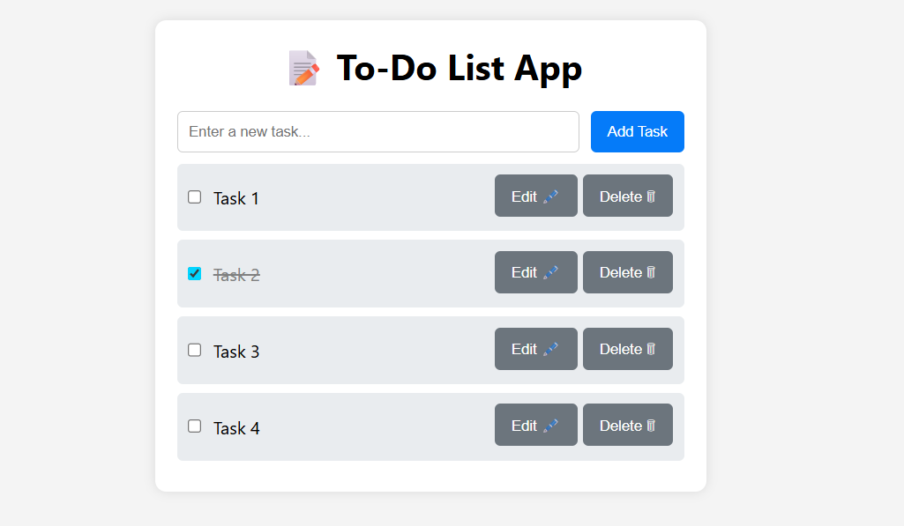

# 📝 To-Do List App

A simple To-Do List application built with vanilla JavaScript, HTML, and CSS. Designed for productivity, this app allows users to add, delete, and manage tasks efficiently.

## 🚀 Features

- ✅ Add tasks with instant validation
- 🗑️ Delete tasks individually 
- 📋 Mark tasks as completed
- 🔄 Persistent state using localStorage
- ⚠️ Error handling for empty inputs
- 🎨 Responsive and clean User Interface

## 📸 Demo



## 🛠️ Tech Stack

| Frontend   | Backend | Storage      |
|------------|---------|--------------|
| HTML       | N/A     | localStorage |
| CSS        |         |              |
| JavaScript |         |              |

## 📂 Project Structure

📁 to-do-list-app
    ├──src
    |  ├── index.html 
    |  ├── style.css 
    |  ├── script.js 
    |
    ├── Demo_image.png
    |
    └── README.md

## 🧠 How It Works

1. **Adding Tasks**: Users input a task and click "Add". Empty inputs trigger a warning.
2. **Marking Complete**: Clicking a task toggles its completed state.
3. **Deleting Tasks**: Each task has a delete button to remove it.
4. **Persistence**: Tasks are saved in `localStorage` and reloaded on page refresh.

## Usage

1. Clone the repository:
   ```
   git clone <repository-url>
   ```

2. Navigate to the project directory:
   ```
   cd to-do-list-app
   ```
   cd src
   ```

3. Open index.html in your browser.
- Start adding tasks!

## 📜 License

This project is licensed under the MIT License.🙌 Contributing Contributions are welcome! Feel free to fork the repo, submit issues, or open pull requests.
---